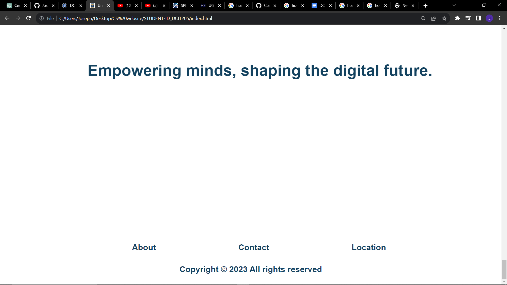
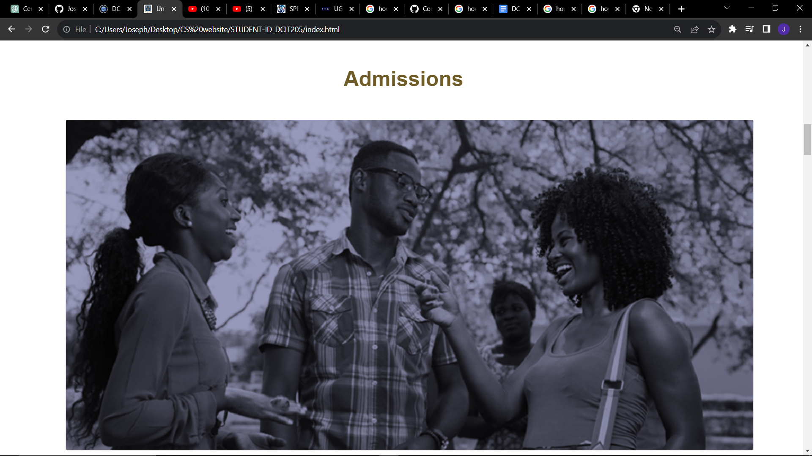

# STUDENT ID_DCIT205

# University of Ghana Computer Science Department Website

# Introduction
Welcome to the official website of the Computer Science Department at the University of Ghana. This comprehensive 10-page website is designed to serve as an informative hub for students, faculty, and anyone interested in exploring the exciting world of computer science. Our primary goal is to provide a user-friendly platform that not only showcases the department's academic offerings but also fosters a sense of community among tech enthusiasts, researchers, and students.

# Purpose of the Website
This website aims to be a central resource for all things related to the Computer Science Department. Whether you are a current student looking for course materials, a prospective student interested in our programs, or a researcher seeking the latest advancements, you'll find valuable information here. The website is structured to highlight academic programs, faculty profiles, research opportunities, and the vibrant community that defines the department.

# Cloning and Setup Instructions
1.Open a terminal or Git Bash.
2.Run the following command to clone the repository: git clone https://github.com/JosephBoamah844/STUDENT-ID_DCIT205.git
3.Change into the project directory: cd STUDENT-ID_DCIT205
4.Open the project in your preferred code editor.
5.Explore the website pages located in the respective folders.

# Author Information
Name: [Joseph Boamah]
Student ID: [11026285]

# Screenshots
Page 1:      
Page 2: 
Page 3: 
Page 4: 
Page 5: 
Page 6: 
Page 7: 
Page 8: 
Page 9: 
Page 10: 

# Project Learnings

Embarking on this project has been a dynamic journey, providing me with a host of invaluable lessons in the realm of web development. 

- **Frontend Development Mastery:** Through the creation of a 10-page website, I honed my frontend development skills. Crafting responsive and visually appealing user interfaces became second nature as I navigated the intricacies of HTML, CSS, and JavaScript.

- **Git and GitHub Proficiency:** The project reinforced my understanding of version control using Git and GitHub. I became adept at cloning repositories, branching, committing changes, and pushing updates. This experience solidified my ability to collaborate efficiently on coding projects.

- **Structural Design Insight:** The process of organizing and structuring a multi-page website significantly contributed to my skills in information architecture. Creating clear and intuitive navigation pathways ensures an enhanced user experience.

- **Responsive Web Design Implementation:** As part of the project, I delved into the principles of responsive web design. Learning how to adapt the layout to different screen sizes not only improves usability but also aligns with contemporary web development standards.

- **User-Centric Approach:** The project emphasized the importance of a user-centric design approach. I gained insights into tailoring the website to meet the diverse needs of our audience, ensuring accessibility and inclusivity.

- **Problem-Solving Agility:** Overcoming various challenges during the development process strengthened my problem-solving abilities. From debugging code to addressing compatibility issues, each hurdle presented an opportunity for growth.

- **Documentation Prowess:** The creation of a comprehensive README document underscores the significance of clear and professional documentation. It serves as a guide for fellow developers, enhancing collaboration and project understanding.

This hands-on experience has not only enhanced my technical proficiency but has also fostered a deeper appreciation for the collaborative and iterative nature of web development projects. As I reflect on the journey, I'm excited to carry forward these learnings into future endeavors, confident in my ability to navigate the evolving landscape of web development.

